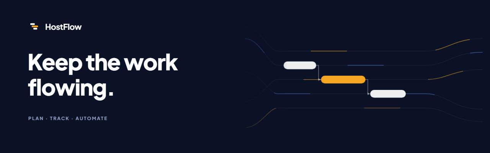
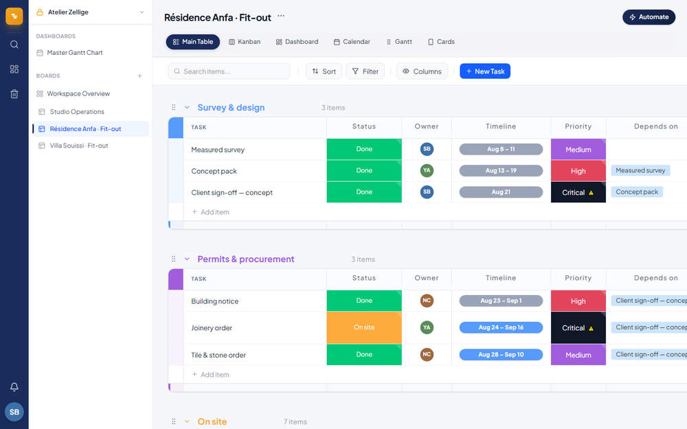
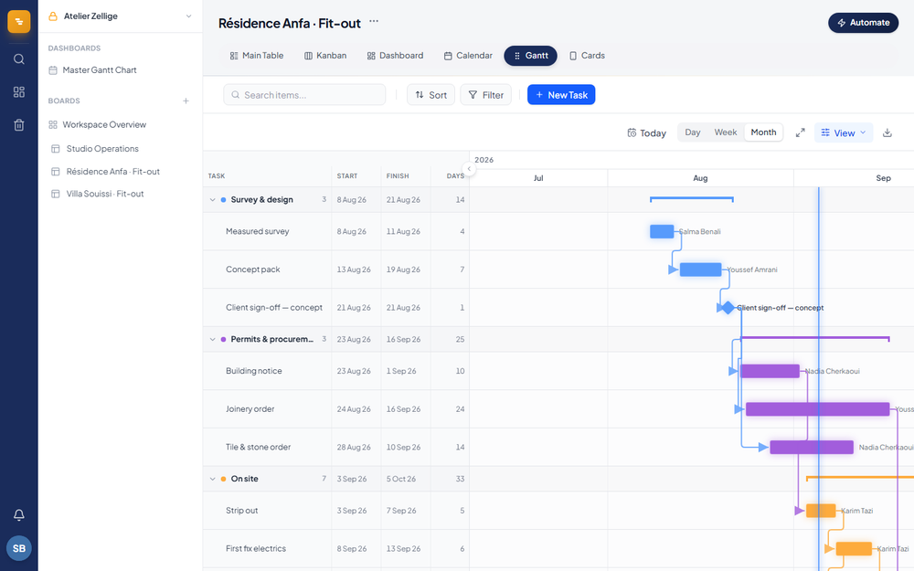
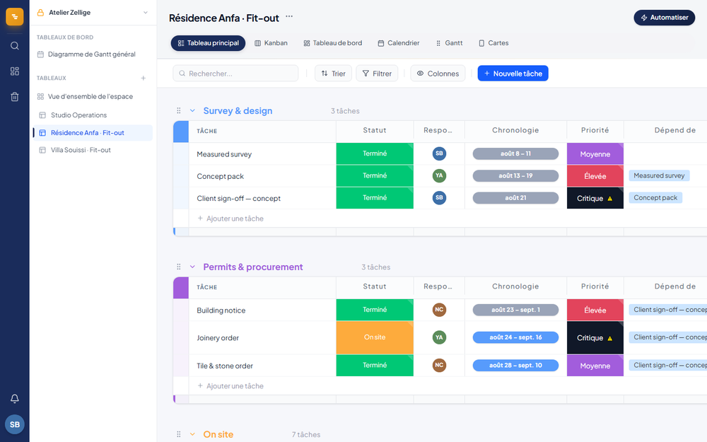
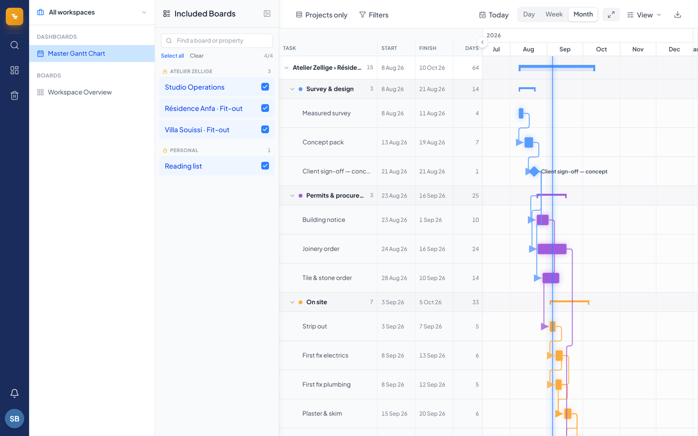
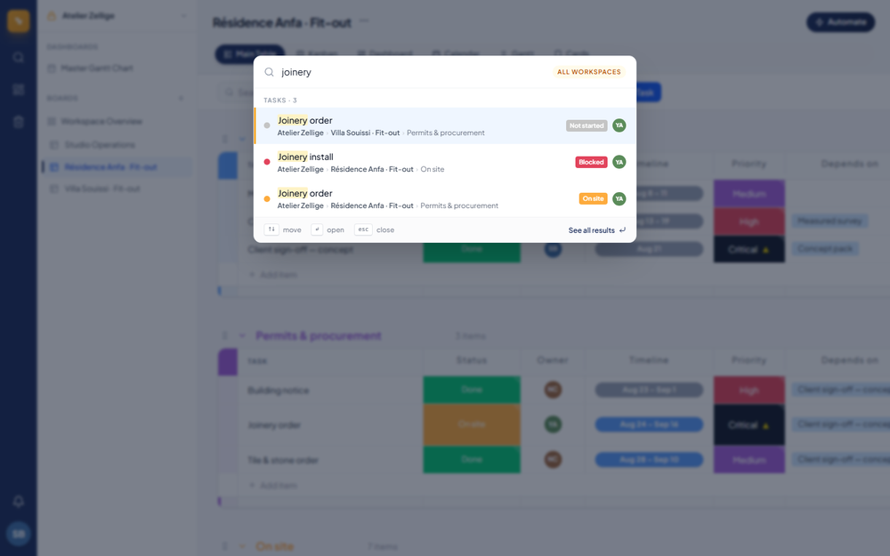
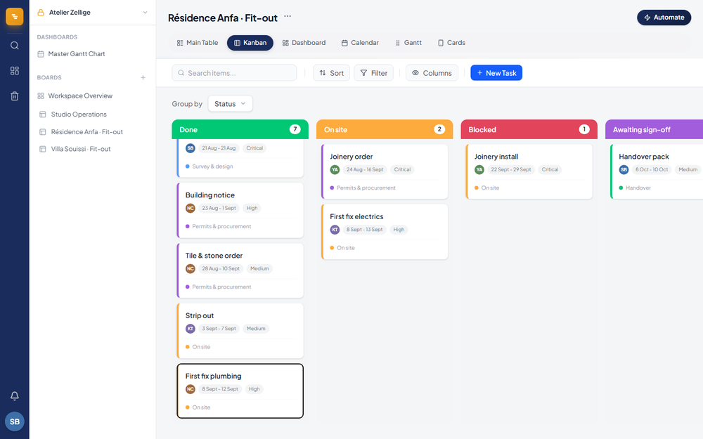
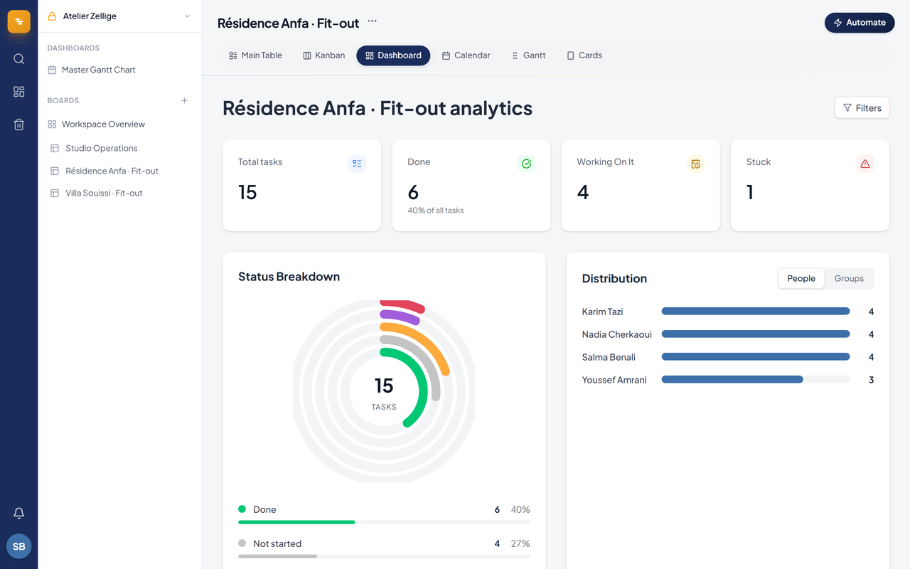
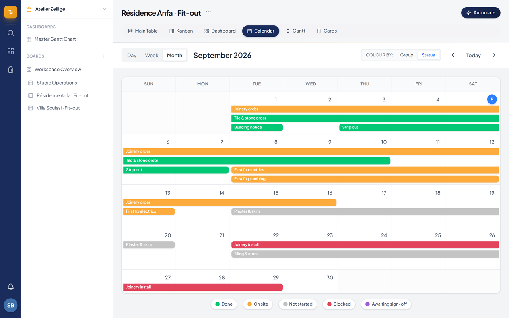

<h1 align="center">
   HostFlow
</h1>

<p align="center">
  <a href="LICENSE"></a>
  
  
  
  
  
  
</p>

<p align="center">
  <strong>Work management for teams that run the same process many times over.</strong><br/>
  Six views over one board, scheduling with a real critical path, and an interface that
  renders in each reader's own language without ever translating their data.
</p>

<p align="center">
  <picture><source srcset="docs/assets/banner.webp" type="image/webp"></picture>
</p>

<p align="center">
  <sub>Those three bars are the logo's own three, drawn at their schedule positions and folded
  back into the mark — the same objects, not a cross-fade. Every screenshot below is the real
  application, driven by <a href="scripts/capture-readme.mjs"><code>scripts/capture-readme.mjs</code></a>
  against the demo tenant that <a href="scripts/seed-demo.mjs"><code>scripts/seed-demo.mjs</code></a>
  creates. Nothing here is a mockup, and nobody's real work appears in it.</sub>
</p>

---

## Features

<table>
<tr>
<td width="50%" valign="middle">

### Six views, one board

Table, Kanban, Dashboard, Calendar, Gantt and Cards read the same tasks. Switching view
changes what you can see, never what is stored — so a date moved on the chart is the same
edit as a date typed in a cell.

</td>
<td width="50%">
<picture><source srcset="docs/assets/views.webp" type="image/webp"></picture>
</td>
</tr>

<tr>
<td width="50%" valign="middle">

### Scheduling that means something

A forward and backward pass over the dependency graph: earliest and latest start and finish,
total float, and the critical path highlighted. Links come in finish-to-start, start-to-start
and finish-to-finish with lag, cross boards and workspaces, and reschedule successors when a
date moves. Cycles and broken constraints are reported rather than silently absorbed.

</td>
<td width="50%">
<picture><source srcset="docs/assets/gantt.webp" type="image/webp"></picture>
</td>
</tr>

<tr>
<td width="50%" valign="middle">

### Bilingual, per reader

The interface, the status and priority labels, the dates and the notifications are written in
the language of whoever is reading them — including a notification written by a colleague in
the other language. What a user typed is never translated: task names, group names, people,
and a board's own status vocabulary stay exactly as entered.

</td>
<td width="50%">
<picture><source srcset="docs/assets/bilingual.webp" type="image/webp"></picture>
</td>
</tr>

<tr>
<td width="50%" valign="middle">

### A portfolio, not a board

Every board in a workspace on one chart, in collapsible swimlanes labelled
`workspace › board`, with a rollup bar per project and dependency arrows that cross between
them. Board names repeat by design — every property runs the same phases — so a row is
identified by where it lives, never by its name alone.

</td>
<td width="50%">

</td>
</tr>

<tr>
<td width="50%" valign="middle">

### Search that knows where things live

One shortcut searches tasks, boards and comment bodies across every workspace you can reach,
and each result carries its full path. Two boards both have a "Joinery order"; the breadcrumb
is what tells them apart.

</td>
<td width="50%">
<picture><source srcset="docs/assets/search.webp" type="image/webp"></picture>
</td>
</tr>

<tr>
<td width="50%" valign="middle">

### Kanban that writes back

Group by any status column and drag between lanes with a pointer or the keyboard. The drop
is an ordinary cell edit, so the table, the chart and the dashboard have already caught up.

</td>
<td width="50%">
<picture><source srcset="docs/assets/kanban.webp" type="image/webp"></picture>
</td>
</tr>

<tr>
<td width="50%" valign="middle">

### Dashboards

Where the work sits, what is finished, what is stuck, and whose desk is holding it — computed
from what each board's labels *mean*, not from matching the English words in them.

</td>
<td width="50%">

</td>
</tr>

<tr>
<td width="50%" valign="middle">

### Calendar

Day, week and month, coloured by group or by status, spanning multi-day work across the grid.

</td>
<td width="50%">

</td>
</tr>
</table>

**Also in the box:**

- **Typed columns** — status, priority, timeline, date, people, tags, dependency, files,
  formula, checkbox, link, rating, relation and button. Status and priority labels are per
  board, so an imported board keeps its own vocabulary.
- **Automations** — move a task when its status changes, alert on a due date, flag overdue
  work. Time-based rules run once a day; the rest fire the moment a matching change is made.
- **Notifications** — in-app, email and Telegram, plus a daily digest of what is due and what
  is late. Finished work is never reported as overdue.
- **Import** — CSV and Excel, including Monday.com exports: groups, columns, status labels,
  people and update history.
- **Permissions** — company and private workspaces, staff and external accounts, per-workspace
  and per-board grants, enforced in Postgres row-level security rather than in the client. See
  [ACCESS_MODEL.md](ACCESS_MODEL.md).
- **Trash and restore**, an activity log per board, baselines that record the plan as agreed,
  and PNG, PDF and spreadsheet export from the chart.

---

## Stack

| | |
|---|---|
| Framework | Next.js 16 (App Router), React 19 with the React Compiler |
| Language | TypeScript, strict |
| Data | Supabase — Postgres, row-level security, Storage, Auth |
| Client state | TanStack Query |
| Styling | Tailwind CSS |
| Email | Resend |
| Monitoring | Sentry |
| Hosting | Vercel, including scheduled jobs |

---

## Running it

Requires Node 20+ and a Supabase project.

```bash
npm install
cp .env.example .env.local   # then fill it in — see below
npm run dev
```

Apply the migrations in `supabase/migrations/` in filename order, either through the Supabase
SQL editor or the CLI.

### Environment

| Variable | Needed for |
|---|---|
| `NEXT_PUBLIC_SUPABASE_URL` | everything |
| `NEXT_PUBLIC_SUPABASE_ANON_KEY` | everything |
| `SUPABASE_SERVICE_ROLE_KEY` | scheduled jobs and server routes — never exposed to the browser |
| `NEXT_PUBLIC_APP_URL` | links inside emails and Telegram messages |
| `CRON_SECRET` | authorises the scheduled jobs; they refuse to run without it |
| `RESEND_API_KEY`, `RESEND_FROM_EMAIL` | outbound email |
| `TELEGRAM_BOT_TOKEN`, `TELEGRAM_LINK_SECRET`, `NEXT_PUBLIC_TELEGRAM_BOT_USERNAME` | Telegram notifications |
| `GOOGLE_CLIENT_ID`, `GOOGLE_CLIENT_SECRET` | Google sign-in and calendar sync |
| `NEXT_PUBLIC_SENTRY_DSN`, `SENTRY_ORG`, `SENTRY_PROJECT` | error reporting |

### Something to look at

```bash
node scripts/seed-demo.mjs          # a demo tenant behind its own account
npm run dev                         # sign in as the address it prints
node scripts/seed-demo.mjs --clean  # and remove every row it created
```

Two fit-out projects running the same four phases five weeks apart, with a dependency chain,
a milestone, a long-lead order and one blocked task. It is what every image above was
captured from. The demo account is a member of nothing else, so it can only ever see the
demo.

---

## Scripts

```bash
npm run dev            # development server
npm run build          # production build
npm run lint           # eslint

npm test               # unit tests (vitest)
npm run test:watch
npm run test:coverage
npm run test:e2e       # Playwright, against a running dev server
npm run test:e2e:ui

npm run test:rls       # sign in as three fixture accounts and assert
                       # what each of them can actually read and write

npm run seed:demo      # create the demo tenant   (--clean removes it)
npm run capture        # re-shoot every image in this README
```

`test:rls` is worth knowing about. Access rules fail quietly — a broken policy does not throw,
it returns rows — so this signs in as a real administrator, a staff member and an external
account over the public key, and checks what actually comes back. It seeds its own namespaced
fixtures and `--clean` removes them.

---

## Scheduled work

Two jobs run daily (see `vercel.json`): the automations pass and the digest. Both record a row
in `cron_runs`, and `/api/cron/watchdog` reports a job that has stopped firing — answering
`503` when something is stale, so an external uptime monitor can watch it. Point one at that
URL; a watchdog that is itself only a cron cannot report that crons have stopped.

---

## Layout

```
app/            routes, API handlers and scheduled jobs
components/     UI, grouped by area — board/, gantt/, search/, views/, cells/
hooks/          data fetching (queries/) and board state (store/)
lib/            domain logic with no React in it: gantt/, automations/,
                dashboard/, dependencies/, i18n/
supabase/       migrations, in filename order
__tests__/      unit tests, mirroring lib/ and components/
e2e/            smoke tests
e2e-gantt/      scheduling tests, driven against a scratch board
scripts/        operational one-offs, each with a dry run or a --clean
```

Three things are less obvious than they look.

**A status cell stores its label as its value.** `"Done"` is both what the dropdown wrote and
what the row holds. Translating a status therefore never means translating what gets written:
[`lib/i18n/labels.ts`](lib/i18n/labels.ts) changes only the rendering, so one board reads
correctly to an English and a French colleague at the same time.

**Boards disagree about vocabulary, so nothing may read the words.** One board says `Fait`,
another says `Done`, a third says `On site`, and all three are the user's data. Every feature
that has to know whether work is finished, in progress or stuck asks
[`lib/statusSemantics.ts`](lib/statusSemantics.ts), which reads the meaning the board
*declared* on the label and only falls back to matching words when it declared none. A caller
that forgets to pass the board's labels still compiles and still returns an answer — it is
just the wrong one, silently, on exactly the boards that matter most.

**The loosest row-level-security policy wins.** Postgres ORs permissive policies together, so
adding a policy can only ever widen access, never narrow it. Four separate leaks in this
codebase were a second policy quietly outvoting the first. `npm run test:rls` exists because
reading the SQL is not enough to know what an account can see.

---

## License

Copyright © 2026 Youness Nait Oufkir.

HostFlow is free software under the [GNU Affero General Public License, version 3](LICENSE).
You may use it, study it, change it and host it yourself. The one obligation the AGPL adds
over the ordinary GPL is the one that matters for something you reach over a network: if you
run a modified version as a service other people use, you have to offer those people its
source.

It is distributed in the hope that it will be useful, but **without any warranty** — see
sections 15 and 16 of the licence.
